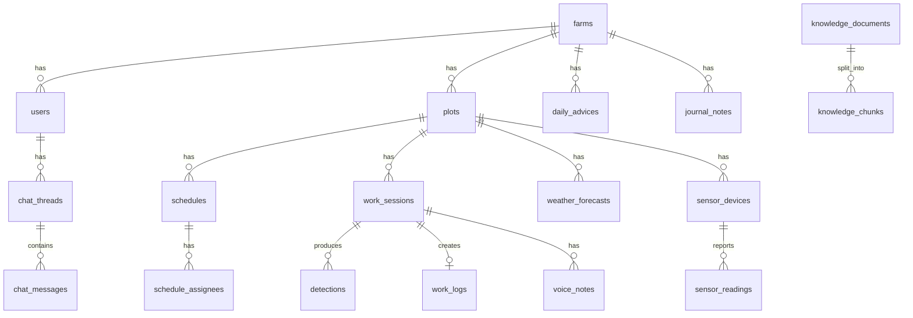

# データモデル

PostgreSQL 16（pgvector 拡張）を使う。`detections`・`evaluation_runs` 以外のテーブルは実装済み。ほかは設計段階。

時刻はタイムゾーン付きで保存し、端末の時刻とサーバーの受信時刻を分けて持つ。
書き込みの重複は、端末が作る `client_event_id` の一意制約で防ぐ。

テーブルは起動時に作る。既存のテーブルにあとから足した列（`work_sessions.uses_hat`、`voice_notes.recorded_at`）は、起動時に列がなければ足す（`backend/app/db.py` の `ADDED_COLUMNS`）。

## 組織・人

| テーブル | 主な列 | 備考 |
|---|---|---|
| `farms` | `code`, `name` | 経営体 |
| `users` | `farm_id`, `name`, `role`, `gender`, `worker_type`, `weekly_max_hours`, `pin_hash`, `failed_pin_count`, `locked_until`, `icon`, `active` | `role` は `owner` / `worker`。`active` が偽の人は停止中 |

## 農地

| テーブル | 主な列 | 備考 |
|---|---|---|
| `plots` | `farm_id`, `name`, `municipality`, `latitude`, `longitude`, `cultivation_type`, `soil_check_pct`, `soil_dry_raw`, `soil_wet_raw` | 作業する場所。画面では「農園」と表示する。`cultivation_type` は `house` / `open_field`（既定は `open_field`）。`soil_*` は土壌水分の換算と助言に使う |

## 予定と作業

| テーブル | 主な列 | 備考 |
|---|---|---|
| `schedules` | `client_event_id`, `farm_id`, `plot_id`, `date`, `start_time`, `end_time`, `work_types`, `note`, `created_by` | 人が入力する予定 |
| `schedule_assignees` | `schedule_id`, `user_id` | 担当者（複数） |
| `work_sessions` | `client_event_id`, `farm_id`, `plot_id`, `user_id`, `work_type`, `schedule_id`, `uses_hat`, `started_at`, `ended_at`, `config_snapshot` | 作業1回分。開始時に配った判定設定を `config_snapshot` に残す。`uses_hat` が偽なら帽子なしで始めた作業で、`config_snapshot` は空。1つの予定から担当者ごとに作業ができる |
| `detections` | `client_event_id`, `session_id`, `detected_at`, `verdict`, `model_version` ほか | 判定1件。列は [ai.md](ai.md) の検討結果に合わせて決める |
| `work_logs` | `farm_id`, `session_id`, `plot_id`, `user_id`, `work_type`, `worked_on`, `started_at`, `ended_at` | セッションの終了時に自動で作る |
| `voice_notes` | `client_event_id`, `session_id`, `user_id`, `storage_key`, `transcript`, `transcribed_at`, `knowledge_document_id`, `recorded_at`, `created_at` | 「今日の気づき」。音声は S3 に置く。文字はスマートフォンで起こしたものを受け取り、知識にも加える。`recorded_at` は端末で録音した時刻、`created_at` はサーバーが受け取った時刻 |
| `judgment_params` | `farm_id`, `work_type`, `params` | 判定の閾値。セッション開始時にアプリへ配る |

作業の種類は `剪定` `灌水` `肥料` `摘果・摘葉` `収穫` `防除` `草刈り` `その他` の8つ。

## センサーと天気

| テーブル | 主な列 | 備考 |
|---|---|---|
| `sensor_devices` | `name`, `plot_id`, `key_hash`, `dev_eui`, `last_seen_at` | 実装済み。デバイスキーはハッシュで保存する |
| `sensor_readings` | `sensor_device_id`, `measured_at`, `temperature`, `humidity`, `pressure`, `soil_moisture_raw`, `soil_moisture_pct`, `battery_pct`, `source` | 実装済み。同じ端末・同じ測定時刻は1件だけ |
| `weather_forecasts` | `plot_id`, `date`, `temp_max`, `temp_min`, `precip_mm`, `weather_code`, `fetched_at` | 天気予報（Open-Meteo の気象庁モデル）を1日1回取り込む |
| `irrigation_settings` | `plot_id`, `rain_skip_mm`, `hot_temp_c` | 灌水の助言で使う雨量・気温の目安。行がなければ既定値（10mm・33℃） |

土壌水分は生値と換算値の両方を持つ。校正をやり直したとき、生値から過去の値を計算し直せるようにするため。

## AI

| テーブル | 主な列 | 備考 |
|---|---|---|
| `daily_advices` | `farm_id`, `date`, `summary`, `body`, `context`, `model`, `generated_at` | 今日のひとこと。生成に使った材料を `context` に残す |
| `chat_threads` | `farm_id`, `user_id`, `session_id`, `title`, `created_at`, `updated_at` | `session_id` は作業中の相談のときだけ入る |
| `chat_messages` | `thread_id`, `role`, `content`, `tools_used`, `created_at` | `tools_used` は回答のときに AI が呼んだ関数 |
| `knowledge_documents` | `farm_id`, `title`, `source_type`, `body` | 相談に使う知識の原本。`farm_id` が空なら全経営体で共有 |
| `knowledge_chunks` | `document_id`, `farm_id`, `content` | 段落ごとに分けたもの。2文字ずつの重なりで近さを測って検索する |
| `evaluation_runs` | `model_version`, `dataset`, `work_type`, `sample_count`, `agreement_rate`, `breakdown` | 判定精度の評価結果 |

## 農園日誌

| テーブル | 主な列 | 備考 |
|---|---|---|
| `journal_notes` | `farm_id`, `date`, `note`, `updated_by`, `updated_at` | 手で書く備考だけを保存する。ほかの欄は表示のたびに組み立てる（気温はセンサーの最高・最低、天気はその日の朝に取り込んだ予報、作業人数と作業内容は作業ログ） |
