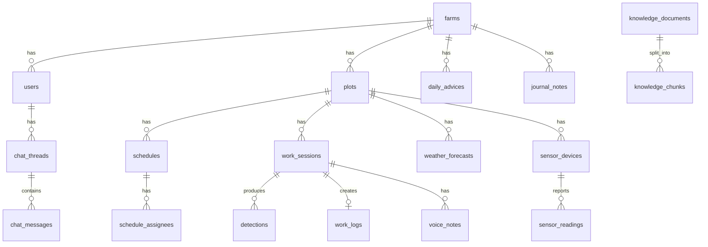

# データモデル

PostgreSQL 16（pgvector 拡張）を使う。組織・人、園地、予定と作業（`detections`・`voice_notes` を除く）、センサーのテーブルは実装済み。ほかは設計段階。

時刻はタイムゾーン付きで保存し、端末の時刻とサーバーの受信時刻を分けて持つ。
書き込みの重複は、端末が作る `client_event_id` の一意制約で防ぐ。

## 組織・人

| テーブル | 主な列 | 備考 |
|---|---|---|
| `farms` | `code`, `name` | 経営体 |
| `users` | `farm_id`, `name`, `role`, `gender`, `worker_type`, `weekly_max_hours`, `pin_hash`, `failed_pin_count`, `locked_until`, `icon` | `role` は `owner` / `worker` |

## 園地

| テーブル | 主な列 | 備考 |
|---|---|---|
| `plots` | `farm_id`, `name`, `municipality`, `latitude`, `longitude`, `cultivation_type`, `soil_check_pct`, `soil_dry_raw`, `soil_wet_raw` | 画面上の「農園」にあたる。`cultivation_type` は `house` / `open_field`（既定は `open_field`）。`soil_*` は土壌水分の換算と助言に使う |

## 予定と作業

| テーブル | 主な列 | 備考 |
|---|---|---|
| `schedules` | `client_event_id`, `farm_id`, `plot_id`, `date`, `start_time`, `end_time`, `work_types`, `note` | 人が入力する予定 |
| `schedule_assignees` | `schedule_id`, `user_id` | 担当者（複数） |
| `work_sessions` | `client_event_id`, `farm_id`, `plot_id`, `user_id`, `work_type`, `schedule_id`, `started_at`, `ended_at`, `config_snapshot` | 作業1回分。開始時に配った判定設定を `config_snapshot` に残す |
| `detections` | `client_event_id`, `session_id`, `detected_at`, `verdict`, `model_version` ほか | 判定1件。列は [ai.md](ai.md) の検討結果に合わせて決める |
| `work_logs` | `farm_id`, `session_id`, `plot_id`, `user_id`, `work_type`, `worked_on`, `started_at`, `ended_at` | セッションの終了時に自動で作る |
| `voice_notes` | `session_id`, `user_id`, `s3_key`, `transcript`, `transcribed_at` | 「今日の気づき」。文字起こしは後から埋める |
| `judgment_params` | `farm_id`, `work_type`, `params` | 判定の閾値。セッション開始時にアプリへ配る |

作業の種類は `剪定` `灌水` `肥料` `摘果・摘葉` `収穫` `防除` `草刈り` `その他` の8つ。

## センサーと天気

| テーブル | 主な列 | 備考 |
|---|---|---|
| `sensor_devices` | `name`, `plot_id`, `key_hash`, `dev_eui`, `last_seen_at` | 実装済み。デバイスキーはハッシュで保存する |
| `sensor_readings` | `sensor_device_id`, `measured_at`, `temperature`, `humidity`, `pressure`, `soil_moisture_raw`, `soil_moisture_pct`, `battery_pct`, `source` | 実装済み。同じ端末・同じ測定時刻は1件だけ |
| `weather_forecasts` | `plot_id`, `date`, `temp_max`, `precip_mm`, `weather`, `fetched_at` | 気象庁の予報を1日1回取り込む |

土壌水分は生値と換算値の両方を持つ。校正をやり直したとき、生値から過去の値を計算し直せるようにするため。

## AI

| テーブル | 主な列 | 備考 |
|---|---|---|
| `daily_advices` | `farm_id`, `date`, `summary`, `body`, `context` | 今日のひとこと。生成に使った材料を `context` に残す |
| `chat_threads` | `user_id`, `session_id`, `title`, `created_at` | `session_id` は作業中の相談のときだけ入る |
| `chat_messages` | `thread_id`, `role`, `content`, `created_at` | |
| `knowledge_documents` | `title`, `source_type`, `body` | 相談に使う知識の原本 |
| `knowledge_chunks` | `document_id`, `content`, `embedding` | 検索用に分割したもの |
| `evaluation_runs` | `model_version`, `dataset`, `work_type`, `sample_count`, `agreement_rate`, `breakdown` | 判定精度の評価結果 |

## 農園日誌

| テーブル | 主な列 | 備考 |
|---|---|---|
| `journal_notes` | `farm_id`, `date`, `note` | 手で書く備考だけを保存する。気温・天気・作業人数・作業内容は、作業ログと天気予報から表示のたびに組み立てる |
