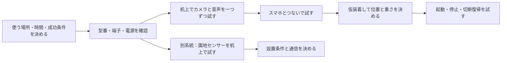

# ハード開発で何を決めるか — 初心者向けガイド

**最初の目標は、机の上で「撮れる・声を送れる・音が出る」を確かめることです。その後に、スマホとの連携と帽子への取り付けを考えます。**

購入する部品を一から選ぶ段階ではありません。[購入・注文済みハード](hardware-inventory.md)を使い、どう接続して、どこに置いて、どう動かすかを決める段階です。
このガイドの「最初の案」は試作の提案です。確定仕様や動作保証ではありません。実機検証はこれからです。

## まず知っておく全体像

| もの | 役目の設計案 | ハード担当が確認すること |
|---|---|---|
| 帽子側のRaspberry Pi（小さなコンピューター） | カメラの映像、マイクの声をスマホへ送り、返ってきた音を鳴らす | 撮影・録音・再生・通信・電源・装着 |
| スマートフォン | AIで画像を判定し、話す内容を決める | アプリ担当と接続方法を合わせる |
| 園地側のESP32（センサーを読む小さな制御基板） | 土壌水分や温湿度などを読む | センサー配線・計測・送信・屋外設置 |

帽子と園地センサーは別の機器です。土壌水分センサーを帽子に付けるわけではありません。



## 全項目を一度に決めなくてよい

| 順番 | 決める項目 | 決めるタイミング | 一緒に考える人 |
|---|---|---|---|
| 1 | D01 何ができれば試作成功か | 作業を始める前 | チームの仕様責任者 |
| 2 | D02 型番・端子、D03 電源 | 電気をつなぐ前 | ハード担当。読めない仕様は経験者に確認 |
| 3 | D04 音声、D05 カメラ | 机上の単体試験 | ハード担当・AI担当 |
| 4 | D06 通信、D07 判定のきっかけ | スマホとの統合前 | アプリ担当・AI担当 |
| 5 | D08 取り付け、D09 起動と復旧 | 単体動作後・装着試験前 | ハード担当・実際に使う人 |
| 6 | D10 センサー配線、D11 設置と校正、D12 送信 | センサー開発に着手するとき | ハード担当・バックエンド担当・農家 |

「担当」は役割の提案です。最初に実際の人の名前を当てはめてください。電源や端子の不明点はつなぐ前に解消し、重さや画質などは小さく試して判断します。

## D01 — どこで、何分、何ができれば成功か

**なぜ必要？** 机上で5分動くものと、畑で何時間も使うものでは、電池も固定方法も変わるからです。

- **決めること:** 最初の試験場所、必要な連続使用時間、実演する一連の動作、追加費用の上限、試験日。
- **選択肢:** 机上試験 → 室内で仮装着 → 屋外試験。進むほど通信・風・日光・装着の条件が増える。
- **最初の案:** 机上で「カメラ画像を確認し、マイク録音を再生する」まで。その次に「スマホから音を返す」へ進む。
- **決まったと言える条件:** 「どこで／何分／何をする／誰が成功を確認する」が1文で書ける。時間はチームで決め、未設定のまま電池容量から推測しない。
- **相談相手:** 仕様責任者。帽子を先に進める既存方針と、センサーをどこまで作るかを確認する。

## D02 — 手元の部品は、どの端子につなぐものか

**なぜ必要？** 商品名が似ていても、ピン配置やプラグ規格が同じとは限らないからです。

- **決めること:** 各部品の正確な型番、基板の版、端子名、対応するケーブル、足りないもの。
- **最初の案:** Pi、ESP32、マイク、USBオーディオ変換器、カメラケーブルの表裏と端子を撮り、説明書と照合する。配送待ちのハブ・ケースは到着状況を更新する。
- **確認方法:** 「部品Aの端子名 → ケーブル → 部品Bの端子名」を紙に描く。差し込めそう、という理由だけで接続を決めない。
- **残すもの:** 型番入り部品表、説明書のリンク、端子名が読める写真、接続図。公開写真に注文者情報を含めない。
- **相談相手:** ハード担当。電圧・端子の意味が分からない箇所を印で示し、経験者にそこだけ確認してもらう。

## D03 — どこから電気を供給するか

**なぜ必要？** Piだけで動いても、カメラ・音声・通信を同時に使うと停止する可能性があるからです。

- **決めること:** バッテリーのどの出力から、どの線でPiとスピーカーを給電するか。ハブ経由の周辺機器を含む必要電力、連続使用時間。
- **選択肢:** 一つの電池にまとめると持ち運びやすい。一方、給電を分けると切り分けやすいが線と荷物が増える。まず説明書の定格を確認して候補を絞る。
- **注意する区別:** 電圧（V）は機器に合う値が必要。電流（A）は必要な量を供給できるかを見る。5000mAhという容量表記だけでは、システム全体の稼働時間は決まらない。
- **確認方法:** Pi単体 → カメラ追加 → 音声追加 → Wi-Fiも同時使用、の順に試す。D01の時間だけ動かし、再起動・音切れ・給電警告・残量を記録する。
- **決まったと言える条件:** 電源の経路とケーブルが図で説明でき、同時使用で必要時間を満たす。

Pi Zero 2 Wには給電用と周辺機器用のmicro USB端子があります。役割を確認して接続してください。[Raspberry Pi公式ハードウェア資料](https://www.raspberrypi.com/documentation/computers/raspberry-pi.html)

購入したOTGハブの給電・充電対応は未確認です。別電源をハブにも加える配線は、電気が意図せず逆流しない構成か説明書で確認してから決めます。GPIOの電源ピンへの直接給電は初心者向けの最初の案には含めません。

## D04 — マイクの声とスピーカーの音を、どう通すか

**なぜ必要？** USBケーブルが付いていても、音をUSBで受け取る製品とは限らないからです。

購入したBSSP105UBKはメーカーが「USB電源モデル」と案内しています。音声入力の端子は取扱説明書・現物も照合します。[バッファロー公式製品情報](https://www.buffalo.jp/product/detail/bssp105ubk.html)

- **決めること:** マイクのプラグ規格、変換器との適合、スピーカーへの音声経路と電源経路、取り付け位置と音量。
- **最初の接続候補:** マイク → UGREENのマイク入力 → USBでPi。Pi → UGREENの音声出力 → 適合するスピーカー入力。スピーカーの給電は別の線としてD03に描く。端子の適合を確認してから試す。
- **確認方法:** 最初は録音して後から再生する。次に発話しながら再生し、再生音をマイクが拾って会話を繰り返したり、大きな雑音になったりしないか確かめる。
- **選択肢:** 再生中も声を聞く方式は自然に会話できるが、音の回り込み対策が必要。再生中はマイクを止める方式は単純だが、話を遮れない。アプリ担当と体験を選ぶ。
- **決まったと言える条件:** 本人の声を録音でき、使う場所で応答が聞き取れ、誤反応の扱いが決まる。

## D05 — カメラをどこに向け、どのくらいの画質にするか

**なぜ必要？** 映像が出ても、判定したい実が小さい・ぶれる・手で隠れるとAIに渡す材料として使えないからです。

- **決めること:** 帽子上の位置・角度、対象との距離、解像度（画像の細かさ）、フレームレート（1秒に送る画像の枚数）、ピントの方針。
- **選択肢:** 広く写すと対象を入れやすい反面、実が小さく写る。細かい画像や高いフレームレートは情報が増える反面、転送や処理が重くなる。
- **最初の案:** 角度を変えられる仮固定で、実際の作業距離・顔の向き・手の位置で短い映像を撮る。AI担当に画像を見てもらってから設定を決める。
- **確認方法:** 静止、頭を動かす、手を伸ばす、明暗が変わる場面を比べる。「きれいに見える」だけでなく、AI担当が対象を判別できるか確認する。
- **決まったと言える条件:** 位置・距離・設定を記録し、その条件でAI担当が使えるサンプルを受け取る。

Zero用のカメラ端子に合うケーブルと向きは公式の取り付け手順で照合します。カメラケーブルの着脱は電源を切って行います。[Raspberry Pi公式カメラ取り付け資料](https://www.raspberrypi.com/documentation/accessories/camera.html)

## D06 — スマホと何を、どの形式でやり取りするか

**なぜ必要？** ハード側から送れても、アプリ側がその形式を読めなければ連携できないからです。

- **決めること:** 接続に使うスマホ、Wi-Fiの設定、Piの見つけ方、映像・音声の送り先と形式、接続・切断の通知方法。
- **現行案:** スマホのテザリング経由。映像はMJPEG（JPEG画像を連続で送る形式）、音声はPCM（音の波形を数値化したデータ）。これだけでは接続仕様は完成していない。
- **アプリ担当と埋める項目:** 映像のURL・ポート番号、音声の転送方式、1秒あたりのサンプル数・ビット数・チャンネル数、開始／停止の合図、再接続の方法。
- **確認方法:** まず1枚の画像と短い音声を受け渡す。その後に連続転送を試し、スマホをポケットに入れ、画面を消しても続くか確かめる。
- **決まったと言える条件:** 双方が同じ設定表を使って送受信できる。Wi-Fiのパスワードや本物のAPIキーは公開資料に記載しない。

「インターネットにつながらない」と「帽子とスマホのWi-Fiが切れる」は別です。前者では一次応答を続ける要件ですが、後者では映像・音声自体を渡せないため、切断の知らせ方を決める必要があります。

## D07 — いつ判定し、遅いときにどうするか

**なぜ必要？** カメラは撮り続けても、いつの画像を判定するかは別の決定だからです。

- **決めること:** 判定のきっかけ、対象の選び方、連続して反応しすぎない仕組み、応答を待てない場合の扱い。
- **選択肢:** スマホ操作、音声、視野中央での条件判定、物理ボタンなど。物理ボタンなら追加配線、音声なら認識処理、中央判定ならアプリ側の条件が必要。現時点で方式を固定しない。
- **最初の案:** 机上試験ではアプリ担当が用意する手動のきっかけで1回ずつ流れを確認する。装着時の操作は別途選ぶ。
- **確認方法:** 「きっかけ → 対象画像 → AI判定 → 音声開始」を一連で測る。既存要件は一次応答1秒以内。何回試したか、典型的な時間と最も遅かった時間を残す。
- **決まったと言える条件:** アプリ・AI・ハードの誰がどこを処理するかと、遅延の測り方が一致する。ハードだけで1秒を保証する約束にしない。

## D08 — 何を帽子に載せ、何を体側へ逃がすか

**なぜ必要？** 机上で動く構成を全部頭に載せると、重さ・ずれ・配線が作業の邪魔になるかもしれないからです。

- **決めること:** カメラ、Pi、電池、マイク、スピーカーそれぞれの位置、固定方法、線の経路、ケースと放熱。
- **選択肢:** 頭側にまとめると線は短くなるが重くなる。電池などをポケット側に置くと頭は軽くなるが、線の引っ掛かり対策が必要。
- **最初の案:** まず机上で音声を確認し、その後に取り外せる方法で仮配置する。購入したスピーカーを帽子に載せると決めつけず、重さと聞こえ方を比べる。
- **確認方法:** 総重量を量り、下を向く・左右を見る・腕を上げる動作で、ずれ・視界・ケーブルの引っ張り・熱のこもりを確認する。試験時間と本人の感想を記録する。
- **決まったと言える条件:** カメラ角度がずれず、痛みや熱さを我慢せず操作でき、端子だけにケーブルの力がかからない。ケースがあるだけで防水と扱わない。
- **相談相手:** 実際に装着する人。取り付け穴や恒久固定は仮装着を見てから決める。

## D09 — 誰でも起動・停止・復旧できるか

**なぜ必要？** 開発者のPCがないと動かせない状態では、畑や会場で使えないからです。

- **決めること:** OSと使用ソフトの版、起動時に動かす処理、準備完了の知らせ方、停止手順、通信や処理が止まった場合の復旧方法。
- **選択肢:** 開発中は手動起動だと原因を追いやすい。実演用には自動起動が便利だが、失敗が分かる表示や音も必要。
- **最初の案:** まず手順書どおりの手動起動を完成させ、その後で自動化する。Piの電池を外す前の終了操作も決める。
- **確認方法:** 電源を入れ直す、Wi-Fiを切って戻す、アプリを終了して起動する、の各場面を試す。インターネットだけを切る試験は別に行う。
- **決まったと言える条件:** 別のメンバーが手順書だけで起動・停止でき、切断を認識して復旧できる。ログの場所と、困ったときに渡す情報が分かる。

## D10 — センサーをESP32のどのピンにつなぐか

**なぜ必要？** 基板の電源端子と信号端子は役割が違い、入力できる電圧にも上限があるからです。

- **決めること:** 正確なESP32ボード型番、各センサーの電源・GND・信号の接続先、許容電圧、読むプログラムの環境。
- **用語:** GNDは電気信号の基準。ADCはセンサーの出力電圧を数値に変える機能。I²Cは対応機器を信号線でつなぐ通信方式。BME280基板の対応端子・方式は現物資料で確認する。
- **最初の案:** 型番に合うメーカーの例を使い、BME280と土壌水分センサーを一つずつ読む。最初から5本すべてをつながない。
- **確認方法:** 説明書のピン配置で接続表を作る。土壌水分センサーの商品名にある電源3.3〜5.5Vと、ESP32に入れる信号電圧の許容範囲を別々に確認する。必要なら経験者と計測器で出力を確認する。
- **決まったと言える条件:** 接続表と電圧の根拠があり、単体・同時・Wi-Fi送信中に計測できる。型番未確認のままネットの配線例のGPIO番号をコピーしない。

従来のESP32ではWi-FiとADC2の併用に制約があり、EspressifはADC1を推奨しています。購入ボードのチップを確定して、その機種の資料に従ってピンを選びます。[Espressif公式設計資料](https://docs.espressif.com/projects/esp-hardware-design-guidelines/en/latest/esp32/schematic-checklist.html)

## D11 — どこを測り、その数字を何と呼ぶか

**なぜ必要？** センサーに数字が出ることと、その畑の乾燥具合を正しく表すことは別だからです。

- **決めること:** 測る園地・地点・深さ・本数、センサーごとの識別名、校正方法、常設電源、雨・結露への対策。
- **選択肢:** 1地点なら試しやすいが園地全体を代表するとは限らない。複数地点は違いを見られるが、配線・設置・管理が増える。
- **最初の案:** 1本を同じ土・同じ深さで試し、乾いた状態と水を加えた状態の生値を記録する。乾湿の基準を作る「校正」の練習であり、これだけで正確な水分率％とは呼ばない。
- **確認方法:** 同じ状態で繰り返し測り、値のばらつきとセンサー間の差を見る。温湿度センサーは日射や基板の熱の影響も考え、農家と設置場所を選ぶ。
- **決まったと言える条件:** センサーID・位置・深さ・日時・条件と数値が対応して残る。水をかけてよい部分は製品資料で確認し、基板や端子まで埋める構成にしない。
- **相談相手:** 農家と仕様責任者。水やり判断の閾値はハード担当だけで決めない。灌水提案は現在保留中。

## D12 — センサーの値をいつ送り、送れないときにどうするか

**なぜ必要？** 測定した値が届かなかったり、古い値を今の値と誤解したりすると使えないからです。

- **決めること:** Wi-Fi等の通信経路、電源、測定と送信の間隔、時刻の合わせ方、再送と保存量、故障・欠測・電池残量の表し方。
- **選択肢:** Wi-Fiは既存APIと机上で試しやすいが、常設地点に届く回線が必要。作業者のスマホが帰るとテザリングもなくなる。LoRaWANは追加機器や受信環境が要るため、購入したESP32だけで使える前提にはしない。
- **最初の案:** まず机上のWi-Fiから既存APIへ送る。現行資料の送信間隔10〜30分は案として、試験中は結果を見やすい間隔をバックエンド担当と決める。
- **確認方法:** 1件送信 → 複数件 → 通信切断 → 復帰の順で確認する。測った時刻と送った時刻を区別し、再送で重複したときの扱いを合意する。
- **決まったと言える条件:** 保存先で計測値を確認できる。現在のAPIはスタブなので、応答成功だけでは保存確認にならない。端末側で保持する期間・件数と、あふれた場合の扱いも決める。
- **相談相手:** バックエンド担当。APIの `battery_pct`（電池残量％）は必須扱いの設計だが、取得手段は未確定。実測できないまま100などを入れず、取得方法かAPI側の未取得表現を相談する。

## 迷ったときの切り分け

| 起きたこと | 最初に分けて確認すること |
|---|---|
| 電源が入らない／途中で再起動 | Pi単体か、周辺機器を追加したときだけか。電源経路と警告を確認 |
| カメラが出ない | 電源を切り、ケーブルの型・向き・差し込みを説明書と照合。その後にソフト設定 |
| 音が出ない | スピーカーの電源と音声入力を別々に確認。先に短い音をローカル再生 |
| マイクが拾わない | 入力端子・プラグ規格・選択した録音機器。先にローカル録音 |
| スマホに届かない | ローカルでは動くか、Wi-Fiに接続したか、送り先と形式が一致するか |
| センサー値がおかしい | 接続表・電圧・使用ピン・Wi-Fi有無・設置条件を一つずつ確認 |

一度に複数の設定を変えず、「変えたこと」と「結果」を残すと、相談する人にも原因が伝わります。

## 最初の打ち合わせで埋める5つの空欄

1. 最初に見せる動作は「＿＿＿＿」。試験日は「＿＿＿＿」。
2. 場所は「＿＿＿＿」、連続で動かす時間は「＿＿分」。
3. アプリ連携の相談相手は「＿＿＿＿」、電気配線の相談相手は「＿＿＿＿」。
4. 現物の型番・端子が未確認なのは「＿＿＿＿」。
5. センサーは今回「机上計測まで／送信まで／現地設置まで」の「＿＿＿＿」。

## 決定と検証を残すテンプレート

項目ごとにコピーして、調べたこと・選んだ理由・結果を書きます。「仮決定」と「実機確認済み」を区別してください。未完了なら次に試すことと担当・確認日を残します。

```text
項目ID・題名：D__ ／
状態：未着手・確認中・仮決定・実機確認済み・保留
今回決めたいこと：
候補と、それぞれの困る点：
選んだ案と理由：
使用部品の正確な型番・説明書：
接続図／設定値：
試験条件（場所・時間・回数）：
合格条件：
実際の結果（数値・写真・ログ）：
相談した相手：
残った問題・次に試すこと：
担当・次の確認日：
```

最終的に、配線図、設定表、起動・停止手順、動作確認結果がそろえば、別のメンバーに引き継げます。
詳細な既存要件は[機能要件](requirements/01-requirements.md)、接続先は[API仕様](requirements/04-api.md)、全体の担当範囲は[引き継ぎ資料](hardware-handoff.md)を参照してください。
