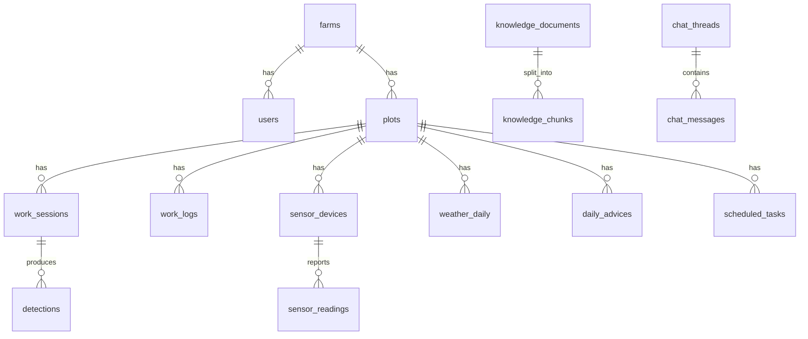

# ドメインモデル・テーブル設計

## 全体像



## テーブル一覧

### 組織・人

| テーブル | 内容 |
|---|---|
| `farms` | 農園（経営体） |
| `users` | 農家さん（owner）/ 作業者（worker） |

`users` は以下を持つ。

- `role` — `owner`（農家さん）/ `worker`（作業者）
- `skill_level` — `beginner` / `intermediate` / `expert`。**農家さんが手動で設定する**。
  Realtime API のシステムプロンプトに渡し、説明の詳しさを変える
- `pin_hash` — 4桁PINのハッシュ。作業者のログインに使う

※ 手袋マーカーによる作業者識別は廃止した。

### 園地

| テーブル | 内容 |
|---|---|
| `plots` | 園地。「3番畑」など。緯度経度を持ち気象取得に使う |

```
plots
  farm_id, name, area_a, latitude, longitude,
  cultivation_type,   -- 'house' | 'open_field'  ★分岐の起点
  notes
```

**`cultivation_type` がシステム全体の分岐の起点になる。**

| 分岐する対象 | ハウス | 露地 |
|---|---|---|
| 土壌水分の由来 | 灌水のみ | 降水＋灌水 |
| 気象APIの降水量 | **使わない** | 使う |
| 栽培暦テンプレート | 収穫 6〜8月 | 収穫 8〜9月 |
| 助言の内容 | 灌水・換気・高温警告 | 降雨後の作業判断・防除タイミング |
| センサーの電源/通信 | AC / Wi-Fi | 太陽電池 / LoRaWAN |

**樹木テーブルは作らない。** YOLOが木を識別できないため、園地単位で足りる。

### 作業

| テーブル | 内容 |
|---|---|
| `work_sessions` | 帽子をかぶって作業した1回分。園地・作業者・作業種別・開始終了 |
| `work_logs` | 作業ログ。栽培暦の元データ |
| `calendar_templates` | 栽培暦のマスタ。**`cultivation_type` ごとに別レコードを持つ** |
| `scheduled_tasks` | 予定タスク |

`work_logs` の主要カラム。

```
plot_id, user_id, work_type, worked_on,
started_at, ended_at, note,
source      -- 'manual'（選択式UI） | 'device'（セッションから自動）
detail      -- 薬剤名・希釈倍率・使用量など (JSONB、任意)
```

記録方法は作業種別で分かれる。

| 作業 | 記録方法 | source |
|---|---|---|
| 摘果・摘葉・収穫 | **セッションから完全自動**（入力なし） | `device` |
| 消毒・施肥・灌水・剪定・除草 | 選択式UI（園地 → 作業種別 → 保存）の3タップ | `manual` |

**帽子をかぶる作業は自動記録できるため、「記入忘れ」が構造的に消滅する。**

`detail` の薬剤名・希釈倍率・使用量は**すべて任意入力**とする。
必須にすると入力が止まり、手書きに戻る。それが最悪の結末である。

作業種別。

```
work_type: 摘果 | 摘葉 | 収穫 | 消毒 | 施肥 | 剪定 | 除草 | 灌水
```

**`灌水` はハウスにおける土壌水分の唯一の説明変数である。**
記録の対象であると同時に、次の灌水タイミングを提案するための入力になる。
灌水量を記録できるよう `extracted` に量を持たせる。

`calendar_templates` は栽培形態で分ける。**ハウスと露地では収穫期が約2ヶ月ずれる。**

| 栽培形態 | 摘果 | 収穫 |
|---|---|---|
| ハウス | — | 6〜8月 |
| 露地 | 5月〜9月中旬（神山町） | 8〜9月 |


### 判定

| テーブル | 内容 |
|---|---|
| `detections` | 判定結果 |

```
detections
  session_id, client_event_id, detected_at, trigger_type,
  verdict, reason_code, confidence,
  target_class, bbox, relative_size, neighbor_count,
  model_version, image_key
```

`trigger_type` は `center`（主案）/ `auto`。

**`relative_size` は周囲の実の面積の中央値に対する比**であり、絶対サイズ（mm）は持たない。
スケール基準となる手袋マーカーを採用しないため。

#### 将来案: `detection_feedbacks`（実装しない）

AIの判定をベテランが修正し、その修正を教師データに還元するテーブル。

```
detection_feedbacks
  detection_id, user_id, feedback_at,
  verdict, corrected_label, corrected_bbox,
  comment,   -- 「この枝は来年の結果枝だから残す」等
  weight     -- 修正者の信頼度（ベテラン1.0 / 初心者0.1）
```

**本選までに運用データが溜まらないため実装しない。**
9月に撮影し10月が本選という日程では、修正が蓄積する時間がない。
マイグレーションには含めないこと。

KPIの根拠は評価用データセットでの一致率とするため、この機能がなくても F-05 は成立する。
ベテラン知識（RAG）の供給源も、撮影同行時の音声録音から確保される。

### 判定基準

| テーブル | 内容 |
|---|---|
| `judgment_params` | 判定閾値。相対サイズ・密集度のしきい値、confidence の境界値 |

#### 将来案: `grade_standards`（実装しない）

すだちの規格（階級名・最小径・最大径）。**絶対サイズを測る手段がないため使わない。**
収穫のサイズ判定を復活させる場合に必要になる。

閾値をコードに埋め込まずDBに持つことで、**ベテランのフィードバックに応じて調整できる。**
これが「ベテランの感覚をデータ化する」の実装にあたる。

### センサー・気象

| テーブル | 内容 |
|---|---|
| `sensor_devices` | センサー端末。園地に紐づく |
| `sensor_readings` | 測定値 |
| `weather_daily` | 気象データ（実測・予報） |

```
sensor_readings
  sensor_device_id, measured_at,
  temperature, humidity, pressure,   -- BME280
  soil_moisture_raw,                 -- ADCの生値（校正前）
  soil_moisture_pct                  -- 換算後 0-100
```

**土壌水分は生値と換算値の両方を持つ。** 生値を残せば、後から校正式を直して過去データを再計算できる。換算値だけだと校正やり直しで過去が使えなくなる。

### AI

| テーブル | 内容 |
|---|---|
| `daily_advices` | 今日のひとことAI |
| `chat_threads` / `chat_messages` | ベテランAI相談 |
| `knowledge_documents` | ベテラン知識の原本 |
| `knowledge_chunks` | 分割＋埋め込み（pgvector） |

```
daily_advices
  plot_id, advice_date, body,
  context_snapshot,   -- 生成に使った材料 (JSONB)
  model, generated_at
```

`context_snapshot` の例。

```json
{
  "sensor": { "temp": 28.4, "humidity": 62, "soil_moisture": 31 },
  "weather": { "precip_7d": 4.5, "forecast": "晴れ" },
  "recent_works": ["8/10 摘果(3番畑)", "8/3 消毒"],
  "calendar": "8月：摘果仕上げ・かいよう病防除",
  "knowledge_refs": [
    { "source": "加茂谷すだちパーク 井出雅文さん", "chunk_id": 42 }
  ]
}
```

**「なぜこの助言か」を辿れることが、AIが適当に言っているという疑いを潰す。**

```
knowledge_documents
  title, source_type,   -- 'interview' | 'calendar' | 'manual'
  source_name,          -- 「NPO法人里山みらい 永野裕介さん」
  body

knowledge_chunks
  document_id, chunk_index, content,
  embedding vector(1536)
```

**出典を必ず持つ。** 「誰の言葉か」を回答に添えられることが製品価値そのものである。

## 設計原則まとめ

| 原則 | 狙い |
|---|---|
| 樹木テーブルを作らない | YOLOが木を識別できない。園地単位で足りる |
| 帽子作業は自動記録、その他は3タップ | 入力の手間が記録の継続を左右する |
| 薬剤名・倍率は任意入力 | 必須にすると入力が止まり手書きに戻る |
| `daily_advices.context_snapshot` | 説明可能性 |
| 土壌水分は raw と pct の両方 | 校正やり直しでも過去データが生きる |
| 知識に出典を必須化 | 「井出さん談」と示せることが製品価値 |
| `detections.model_version` | モデル改善の効果を測定できる |
| 絶対サイズを持たず相対比較にする | 特殊な装備が不要になり、現場フィットが上がる |
| `users.skill_level` は手動設定 | 自動算出は本選までにデータが溜まらない |
| 判定閾値をDBに持つ | フィードバックで調整できる |
| `client_event_id` を最初から受ける | 本番のオフライン同期対応時にAPIを変えずに済む |
